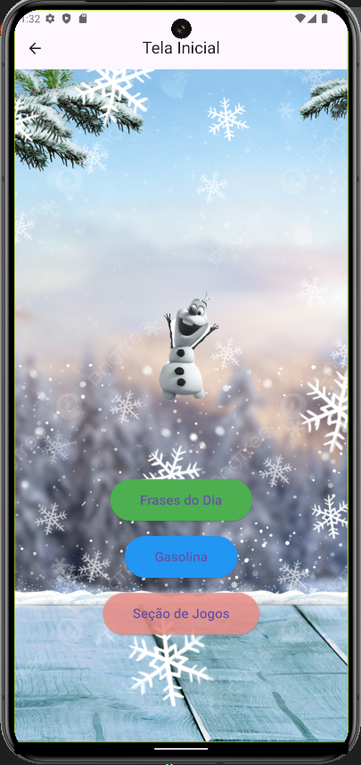
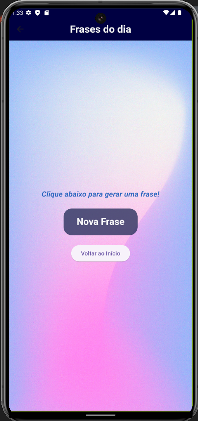
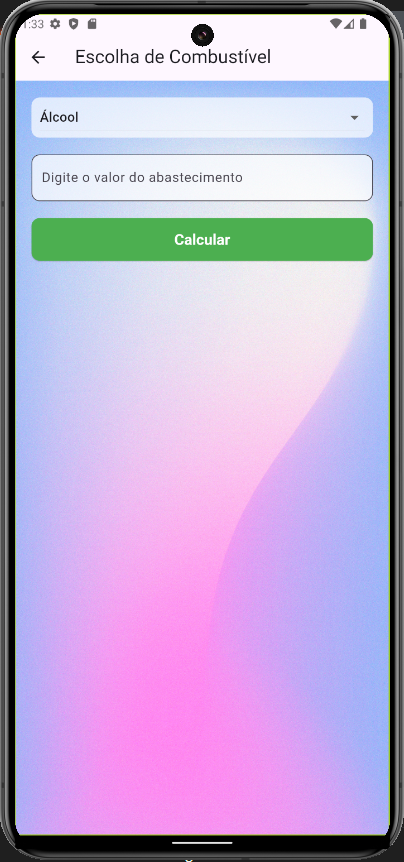
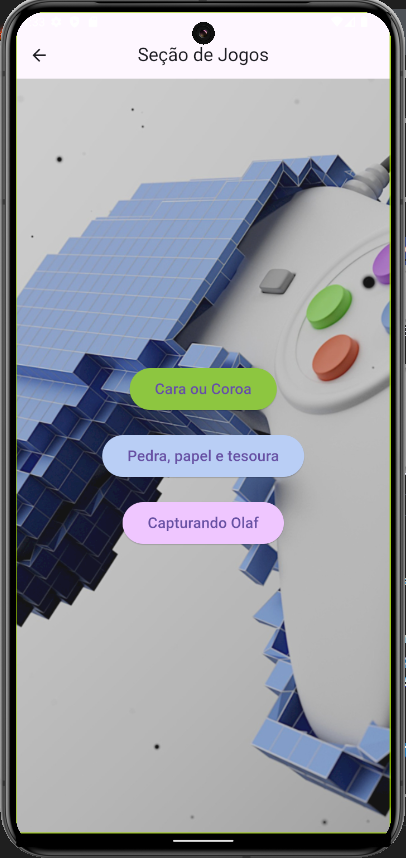
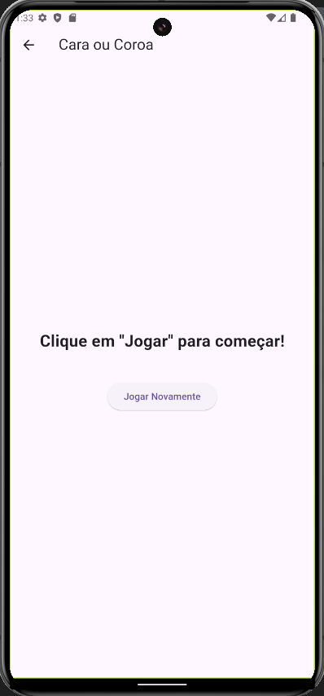
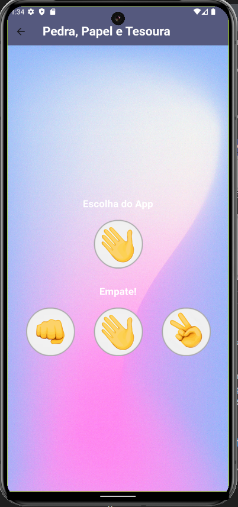
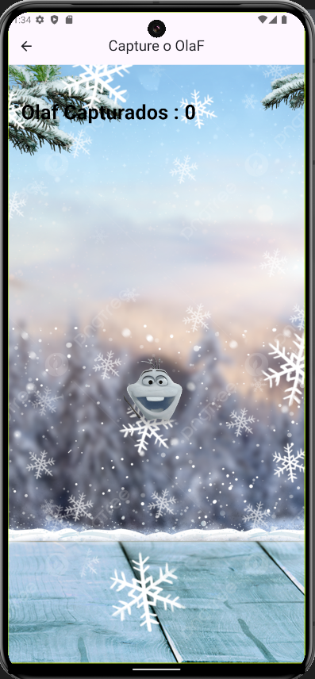

# 📖 Documentação do Aplicativo Flutter

## 🚀 Visão Geral
Este aplicativo Flutter foi desenvolvido com o objetivo de demonstrar funcionalidades variadas por meio de uma interface intuitiva e organizada. O aplicativo oferece as seguintes seções principais:

* Frases do Dia: Gera frases motivacionais aleatórias para desenvolvedores.
* Gasolina: (descrição futura do módulo).
* 🎮 Seção de Jogos: Inclui 3 jogos de Pedra, Papel e Tesoura, cara ou cora e procurando olaf

  
## 2. Tecnologias Utilizadas:

* Linguagem: Dart
* Framework: Flutter
* Outras Dependências:
  * dart:math: Para geração de números aleatórios.
  * flutter/material.dart: Para construção da interface de usuário.
  
# 3. Estrutura do Projeto

## 🧰 Páginas Principais

* InitialScreen:
    * Tela inicial com botões de navegação para as funcionalidades do app.
    * Inclui um fundo customizado e animações (GIF).
     
   
* Home:
   * Tela que exibe frases motivacionais aleatórias.
   * Botão para gerar novas frases e retornar à tela inicial.

       
* TelaCombustivel:
   * aplicativo para ajudar os usuários a calcular qual combustível é mais vantajoso economicamente entre álcool e gasolina.
    
     
* 🎮 JogoScreen:
   * Tela que Inclui 3 jogos: Pedra, Papel e Tesoura, cara ou coroa e procurando Olaf
   
     

# 🔧 Instalação

### 📋 Pré-requisitos

  * Flutter SDK instalado.
  * Dispositivo emulador ou físico configurado para execução.
    
## 📦 Passos para Executar

1. Clone o repositório:
```
git clone https://github.com/Charlesnaldo/Primeiro_Codigo_em_Dart
cd Primeiro_Codigo_em_Dart
```

2. Instale as dependências:
```
flutter pub get
```

3. Execute o aplicativo:

```
Copiar código
flutter run
```
## 5. Estrutura do Código
   
# Tela Inicial (InitialScreen)


- Tela inicial com botões de navegação para as funcionalidades do app.  
- Inclui um fundo customizado e animações (GIF).  
- Três botões principais:
  - **Frases do Dia**: Navega para a página "Home".
  - **Gasolina**: Ajuda os usuários a calcular qual combustível é mais vantajoso.
  - **Seção de Jogos**: Navega para a página "JogoScreen".

<br clear="left"/>


     
## Frases do Dia (Home)


 * Exibe frases motivacionais para dev escolhidas aleatoriamente de uma lista.
 * Possui:
    * Botão para gerar nova frase.
    * Botão para voltar à tela inicial.
  
## GasolinaApp (TelaCombustivel)
 

 * Exibe um dropdow com opçoes para alcool e gasolina.
 * Possui:
    * caixa de texto para digitar o valor do abastecimento
    * Botão para calcular.

## JogoScreen:
 

   * Tela que Inclui 3 jogos: Pedra, Papel e Tesoura, cara ou coroa e procurando Olaf
     

  
## Cara ou Coroa (JogoCaraOuCora)
 

 * Exibe um botao para jogar onde a maquina escolhe um lado aleatoriamente.
 * Possui:   
    * Botão para voltar.
  
## Pedra, Papel e Tesoura (Jogo)
 

 * Exibe 3 opções de escolha para pedra, papel e tesoura.
 * ao escolher a maquina aleatorimente escolhe outra e fazer a comparação e exibe na tela quem ganohou ou se foi empate
 * Possui:   
    * Botão para voltar.
      
## Capturando Olaf (TerceiroJogo)
 

 * Exibe o Persongem Olaf na tela ao clicar ele muda de lugar e começa contagem de quantas vezes foi capturado.
 * Possui:   
    * Botão para voltar.
            
      
      
## Componente Personalizado (AnimatedButton)

  * Botão com animação suave e estilo consistente.

    
## 🧰 6. Recursos e Design

  * Fundo:
    * Imagens localizadas na pasta assets.
    * Configuradas no arquivo pubspec.yaml.
      
  * Estilos:
    * Uso de estilos personalizados em botões e textos para uma interface atrativa.
      
  * Animações:
    * GIFs adicionados para enriquecer a experiência visual.
      
## 📌 Controle de Versão

Este projeto utiliza o Git como sistema de controle de versão. Graças a ele, conseguimos gerenciar o código de forma eficiente, garantindo a rastreabilidade de alterações, colaboração em equipe e a segurança de sempre ter acesso a versões anteriores.

## ✒️ Autores

* Aryadna Martins Pereira
* Ariana Martins Pereira
* Ronaldo Charles de sousa
* Rodrigo da Cunha Andrade

## 🎥 Assista ao vídeo de demonstração


[](https://www.youtube.com/watch?v=YlJkWDIcFhE)


